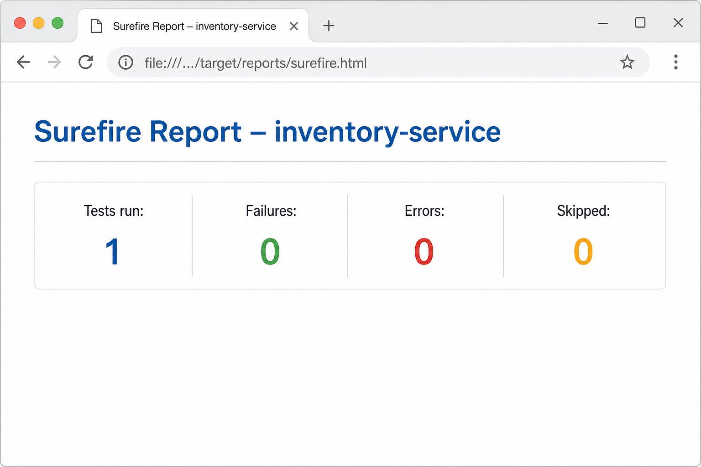

# Inventory Service using Rate Limiting — Setup & Operations Guide

Spring Boot 3 REST API for inventory management backed by **MongoDB**, documented with **OpenAPI 3 / Swagger UI**, protected by **Resilience4j** rate limiting (read vs write) and bulkhead throttling, with a **Postman** collection for testing.

---

## Table of contents

1. [Java version](#1-java-version)
2. [Installing Java (Windows)](#2-installing-java-windows)
3. [Dependencies (Maven)](#3-dependencies-maven)
4. [MongoDB prerequisites](#4-mongodb-prerequisites)
5. [Create database and import sample data](#5-create-database-and-import-sample-data)
6. [Configuration & environment variables](#6-configuration--environment-variables)
7. [Starting the application](#7-starting-the-application)
8. [OpenAPI & Swagger UI](#8-openapi--swagger-ui)
9. [REST endpoints](#9-rest-endpoints)
10. [Rate limiting & bulkhead](#10-rate-limiting--bulkhead)
11. [Postman collection](#11-postman-collection)
12. [Verifying endpoints](#12-verifying-endpoints)
13. [Testing rate limits (examples)](#13-testing-rate-limits-examples)
14. [Build & tests](#14-build--tests)

---

## 1. Java version

| Item | Value |
|------|--------|
| **Required JDK** | **17** or newer (17 or 21 LTS recommended) |
| **Project property** | `java.version` = `17` in `pom.xml` |
| **Spring Boot** | `3.4.x` |

Use a full **JDK** (not only a JRE) so Maven can compile and run tests.

---

## 2. Installing Java (Windows)

### Option A — winget (recommended)

```powershell
winget install EclipseAdoptium.Temurin.17.JDK -e --accept-package-agreements --accept-source-agreements
```

### Option B — Manual installer

- Download **Eclipse Temurin JDK 17** from [https://adoptium.net/](https://adoptium.net/)  
- Or **Microsoft Build of OpenJDK**: [https://learn.microsoft.com/en-us/java/openjdk/download](https://learn.microsoft.com/en-us/java/openjdk/download)

### After install

1. Open a **new** PowerShell or Command Prompt.
2. Verify:

   ```powershell
   java -version
   ```

   You should see `openjdk version "17.x"` (or newer).

3. Optional: set **JAVA_HOME** to the JDK folder (e.g. `C:\Program Files\Eclipse Adoptium\jdk-17.x.x-hotspot`) and add `%JAVA_HOME%\bin` to **Path**.

---

## 3. Dependencies (Maven)

Main libraries (see `pom.xml`):

| Dependency | Purpose |
|------------|---------|
| `spring-boot-starter-web` | REST API (Spring MVC) |
| `spring-boot-starter-data-mongodb` | MongoDB access |
| `spring-boot-starter-validation` | Bean Validation (`@Valid`, etc.) |
| `spring-boot-starter-aop` | Aspects for Resilience4j annotations |
| `springdoc-openapi-starter-webmvc-ui` | OpenAPI 3 + Swagger UI |
| `resilience4j-spring-boot3` | Rate limiting & bulkhead |
| `spring-boot-starter-test` | JUnit / Spring Test (test scope) |
| `de.flapdoodle.embed.mongo.spring3x` | Embedded MongoDB for **automated tests** only (test scope) |

Maven Wrapper is included (`mvnw.cmd` on Windows). Dependencies download on first `mvnw` run.

---

## 4. MongoDB prerequisites

- **MongoDB Server** reachable at **`mongodb://localhost:27017`** (default), or set `MONGODB_URI`.
- Start `mongod` (or use MongoDB Atlas with a connection string — then set `MONGODB_URI` accordingly).

The application uses:

- **Database name:** `inventory` (default), overridable with `MONGODB_DATABASE`.
- **Collection:** `inventory-items` (must match imports; hyphenated name).

**Persistence:** Inventory is stored **only in MongoDB** (`spring-boot-starter-data-mongodb`). The app does **not** use SQLite, H2, or other on-disk `*.db` files. A top-level `data/` directory is **not** required for the service (it is listed in `.gitignore` so optional local files are never committed).

---

## 5. Create database and import sample data

MongoDB creates the database when you first write to it. You do **not** have to create an empty database manually unless you want to.

### 5.1 Optional: create empty collection

```text
mongosh mongodb://localhost:27017/inventory --eval "db.createCollection('inventory-items')"
```

### 5.2 Import JSON (mongoimport)

From the **project root** (adjust path to `mongoimport` if needed — MongoDB `bin` on `PATH`):

```text
mongoimport --uri="mongodb://localhost:27017/inventory" --collection=inventory-items --file=mongo/inventory-items.json --jsonArray
```

### 5.3 Alternative: mongosh script

```text
mongosh "mongodb://localhost:27017/inventory" mongo/seed.mongosh.js
```

### Sample documents

The file `mongo/inventory-items.json` contains three items with fixed `_id` values (ObjectIds), e.g. `507f1f77bcf86cd799439011`.

**Important:** The REST API uses **`id`** as a **24-character hex string** (MongoDB ObjectId). Use the same collection name **`inventory-items`** as in the app (`@Document` on the entity).

More detail: `mongo/IMPORT.txt`.

---

## 6. Configuration & environment variables

| Variable | Purpose | Default |
|----------|---------|---------|
| `MONGODB_URI` | MongoDB connection string | `mongodb://localhost:27017` |
| `MONGODB_DATABASE` | Database name | `inventory` |

Example (PowerShell):

```powershell
$env:MONGODB_URI = "mongodb://localhost:27017"
$env:MONGODB_DATABASE = "inventory"
.\mvnw.cmd spring-boot:run
```

Server port: **8080** (`server.port` in `application.yml`).

---

## 7. Starting the application

From the **project root** (where `pom.xml` lives):

```powershell
cd f:\learning\java\ratelimitusingspringboot
.\mvnw.cmd spring-boot:run
```

Or build a JAR and run:

```powershell
.\mvnw.cmd -q package -DskipTests
java -jar target\inventory-service-1.0.0-SNAPSHOT.jar
```

Wait until logs show the application started (Tomcat listening on port **8080**).

---

## 8. OpenAPI & Swagger UI

| Resource | URL |
|----------|-----|
| **OpenAPI 3 JSON** | [http://localhost:8080/api-docs](http://localhost:8080/api-docs) |
| **Swagger UI** | [http://localhost:8080/swagger-ui.html](http://localhost:8080/swagger-ui.html) |

From Swagger UI you can try all operations (GET/POST/PUT/DELETE) interactively.

---

## 9. REST endpoints

Base path: **`/api/v1/inventory`**

| Method | Path | Description |
|--------|------|-------------|
| `GET` | `/api/v1/inventory` | List all items |
| `GET` | `/api/v1/inventory/{id}` | Get one item by MongoDB ObjectId **string** |
| `POST` | `/api/v1/inventory` | Create item (JSON body: `sku`, `name`, `quantity`, `unitPrice`) |
| `PUT` | `/api/v1/inventory/{id}` | Update item (partial body) |
| `DELETE` | `/api/v1/inventory/{id}` | Delete item |

Example GET after import:

```text
http://localhost:8080/api/v1/inventory/507f1f77bcf86cd799439011
```

---

## 10. Rate limiting & bulkhead

Configured in `src/main/resources/application.yml` (values below match the file at time of writing — **re-open the YAML** if you change limits locally).

### Rate limiter YAML keys (`resilience4j.ratelimiter.instances.<name>`)

These Resilience4j settings control **how many calls** are allowed **per time window**, and what happens when a caller arrives **after** the budget is exhausted.

| Property | Description |
|----------|-------------|
| **`limitForPeriod`** | Maximum number of **permissions** (successful “slots”) granted **within each** `limitRefreshPeriod`. When the count is exhausted for the current window, further callers must **wait** (up to `timeoutDuration`) or be **rejected**, depending on configuration. |
| **`limitRefreshPeriod`** | Length of the **reset window**: after this duration, the permission count for that limiter **refills** to `limitForPeriod` again (Resilience4j’s **fixed-interval** refill model — not a rolling window over arbitrary wall-clock spans). Use values like `10s`, `1s`, `500ms`. |
| **`timeoutDuration`** | Maximum time a thread **blocks** while **waiting for a permit** when the current period is already saturated. **`0`** means **do not wait**: the call **fails fast** once the budget is used (typical for APIs returning **HTTP 429** instead of hanging). Set a positive duration (e.g. `100ms`) if you prefer short back-pressure instead of immediate rejection. |

### Instances in this project

| Instance | Typical use in code | `limitForPeriod` | `limitRefreshPeriod` | `timeoutDuration` | Meaning in practice |
|----------|---------------------|------------------|----------------------|-------------------|---------------------|
| **`inventoryRead`** | `GET` endpoints | **5** | **10s** | **0** | At most **5** successful read-throughs per **10 s** per limiter; extra calls **fail immediately** when the bucket is empty (no wait). |
| **`inventoryWrite`** | `POST`, `PUT`, `DELETE` | **10** | **1s** | **0** | At most **10** write operations per **1 s** per limiter; same fail-fast behavior when exceeded. |

**Example:** With `inventoryRead` as above, a client can complete up to **5** inventory reads in a given **10 s** interval before receiving **429 Too Many Requests** until the next window refreshes.

When the rate limit is exceeded (with `timeoutDuration: 0`), the API returns **HTTP 429** with a problem-details style body (`Too Many Requests`).

### Bulkhead (`resilience4j.bulkhead.instances.inventoryApi`)

Limits **parallelism** (how many requests run **at the same time**), separate from the per-second rate above.

| Property | Value in `application.yml` | Description |
|----------|------------------------------|-------------|
| **`maxConcurrentCalls`** | **20** | Maximum number of **in-flight** calls allowed through this bulkhead at once. Additional callers wait or fail depending on `maxWaitDuration`. |
| **`maxWaitDuration`** | **0** | How long a caller **waits** for a free slot when all `maxConcurrentCalls` are busy. **`0`** means **do not wait** (fail fast — often **HTTP 503** `Service Unavailable` or similar when the pool is saturated). |

If exceeded and not queued, you may see **HTTP 503** (`Service Unavailable`) with a message about concurrent request limits.

---

## 11. Postman collection

Import the file:

```text
postman/Inventory-Service.postman_collection.json
```

- Collection variable **`baseUrl`**: `http://localhost:8080`
- **`itemId`**: default example ObjectId after import — `507f1f77bcf86cd799439011`
- **Create item** uses a distinct SKU (`SKU-POST-001`) to avoid duplicate-SKU conflicts during repeated runs.

Use **Collection Runner** with many iterations and **no delay** to stress rate limits (see below).

---

## 12. Verifying endpoints

1. Start MongoDB and import data (`mongo/inventory-items.json` or `mongo/seed.mongosh.js`).
2. Start the Spring Boot app.
3. **List:** `GET http://localhost:8080/api/v1/inventory` → expect **200** and a JSON array.
4. **By id:** `GET http://localhost:8080/api/v1/inventory/507f1f77bcf86cd799439011` → **200** and one object.
5. **Create:** `POST` with body `{"sku":"NEW-1","name":"x","quantity":1,"unitPrice":9.99}` → **201**.
6. **Update:** `PUT` with partial JSON → **200**.
7. **Delete:** `DELETE` → **204**.

If you see **404**, check collection name **`inventory-items`** and database **`inventory`**.

---

## 13. Testing rate limits (examples)

Adjust expectations to match **your** `application.yml` (limits change if you edit the file).

### PowerShell — many GETs (read limit)

```powershell
1..40 | ForEach-Object {
  try {
    $r = Invoke-WebRequest -Uri "http://localhost:8080/api/v1/inventory" -UseBasicParsing
    "$_ -> $($r.StatusCode)"
  } catch {
    $code = $_.Exception.Response.StatusCode.value__
    "$_ -> $code"
  }
}
```

Expect mostly **200**, then **429** once the read bucket is exhausted for the current window.

### PowerShell — many POSTs (write limit)

Use a **unique `sku` per request** (e.g. `RATE-$_`) so validation does not block with “SKU already exists”:

```powershell
1..15 | ForEach-Object {
  $body = @{ sku = "RATE-TEST-$_"; name = "Load"; quantity = 1; unitPrice = 1 } | ConvertTo-Json
  try {
    $r = Invoke-WebRequest -Uri "http://localhost:8080/api/v1/inventory" -Method POST -Body $body -ContentType "application/json" -UseBasicParsing
    "$_ -> $($r.StatusCode)"
  } catch {
    $code = $_.Exception.Response.StatusCode.value__
    "$_ -> $code"
  }
}
```

### Postman

- Run the **GET list** request in **Collection Runner** with **40+ iterations** and **0 ms delay** between requests.
- Inspect responses: **429** indicates rate limiting is active.

### Lower limits for demos

Temporarily reduce `limitForPeriod` in `application.yml`, restart the app, and repeat — easier to hit **429** without huge request counts.

---

## 14. Build & tests

### Run tests only

From the **project root**:

```powershell
.\mvnw.cmd test
```

If Apache Maven is installed and on your **`PATH`**, `mvn test` does the same. This repository includes the **Maven Wrapper** (`mvnw.cmd` on Windows), so a global `mvn` command is optional.

Tests use **embedded MongoDB** (Flapdoodle) and do **not** require a running local `mongod`.

### Full build (compile, test, package)

```powershell
.\mvnw.cmd clean verify
```

### Viewing Surefire reports

Maven Surefire writes output under **`target/surefire-reports/`** after `test` or `verify`.

| Output | What to use it for |
|--------|-------------------|
| **`TEST-<FullyQualifiedClassName>.xml`** | Per-class machine-readable report: each test method, duration, and failure/error details (including stack traces). |
| **`<SimpleClassName>.txt`** | Short text summary line for that class. |

Open the XML in your editor, or use your IDE’s **Test** view (many IDEs open the matching XML when you click a failed test). The Maven console output also ends with a summary such as: `Tests run: N, Failures: 0, Errors: 0, Skipped: 0`.

### Optional: HTML report in a browser

After tests have run at least once, generate a styled HTML report **without** executing tests again. From the **project root**:

```powershell
cd f:\learning\java\ratelimitusingspringboot
.\mvnw.cmd org.apache.maven.plugins:maven-surefire-report-plugin:3.5.2:report-only
```

If you are **already** in the project directory, the `.\mvnw.cmd … report-only` line alone is enough.

Then open **`target/reports/surefire.html`** in a browser (double-click the file or open it from Explorer). The `target/reports/` folder also contains CSS/JS used by that page.

The following is an **illustrative** view of the generated Surefire HTML report (your counts may differ):



---

## Quick reference URLs

| What | URL |
|------|-----|
| App base | `http://localhost:8080` |
| OpenAPI JSON | `http://localhost:8080/api-docs` |
| Swagger UI | `http://localhost:8080/swagger-ui.html` |
| Inventory API | `http://localhost:8080/api/v1/inventory` |

---

*Generated for the `inventory-service` project. Update this document if you change ports, URIs, or rate-limit settings.*
